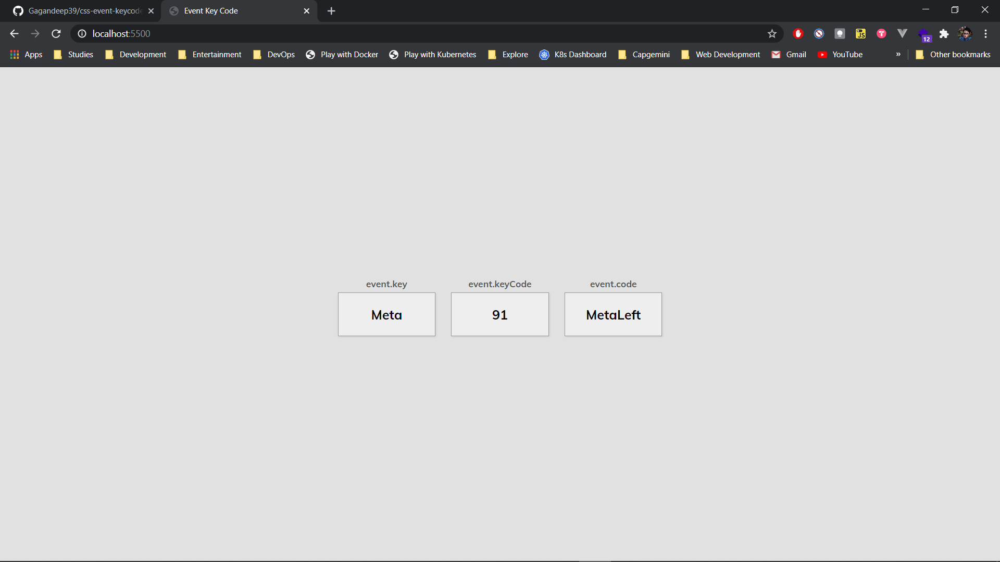
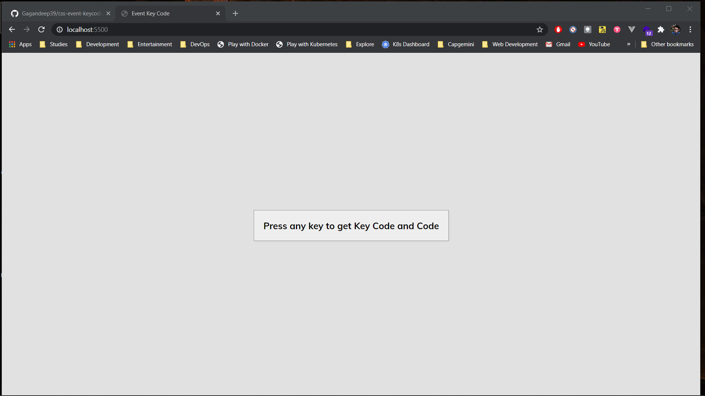

# Event Key Codes

- [Event Key Codes](#event-key-codes)
  - [Deployment](#deployment)
  - [Description](#description)
  - [Screenshots](#screenshots)

## Deployment

- Checkout deployment at https://gagandeep39.github.io/css-event-keycodes

## Description

- Displays keycode on pressing a key
- Used to find key code
- Simple HTML + CSS Project

## Screenshots

